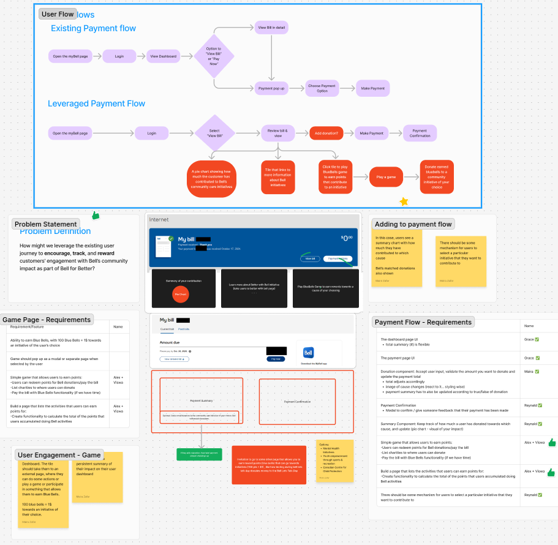

# Bell Industry Hackathon
## Overview
Welcome to the Bell Industry Hackathon project! This repository contains our solution to the challenge presented by Bell Canada during the hackathon event.
### Problem Statement
How might we leverage the existing user journey to encourage, track, and reward customers' engagement with Bell’s community impact as part of Bell for Better?
### Solution Overview
Our solution aims to integrate seamlessly with Bell’s existing platforms to enhance customer engagement by providing real-time tracking and rewarding mechanisms for users who participate in community impact activities and initiatives.
### Features
- Community Impact Dashboard: Visual representation of individual and collective community contributions.
- Contribution Summary Chart: Users see a summary chart showing how much they have contributed to various causes whenever they perform actions like paying a bill.
- Matched Donations: Display Bell's matched donations alongside user contributions.

## Design Document
Our team brainstormed and created a comprehensive Figma document (FigJam) that includes the following elements:
- **User Flow**: Detailed user journey mapping to visualize the steps users take to interact with our solution.
- **Problem Statement**: Clear articulation of the problem we aim to solve.
- **Page Requirements**: Specifications for each page within the application.
- **Wireframes**: Visual representations of the application's layout and structure.
- **Requirements**: List of functional and non-functional requirements assigned to the individual for implementation

You can view the Figma file [here](https://www.figma.com/board/Xs1zgXux3ulbVEEv17R1g1/Bell-Industry-Hackathon-Team-2?node-id=0-1&t=hvLPsebCrO1QfeIc-1).

## Collaborators
[https://github.com/reymaa19](https://github.com/reymaa19)  
[https://github.com/mairazfr](https://github.com/mairazfr)  
[https://github.com/Grace-3908254](https://github.com/Grace-3908254)  
[https://github.com/alexandra-kononova](https://github.com/alexandra-kononova)  
[https://github.com/harishan16](https://github.com/harishan16)   
